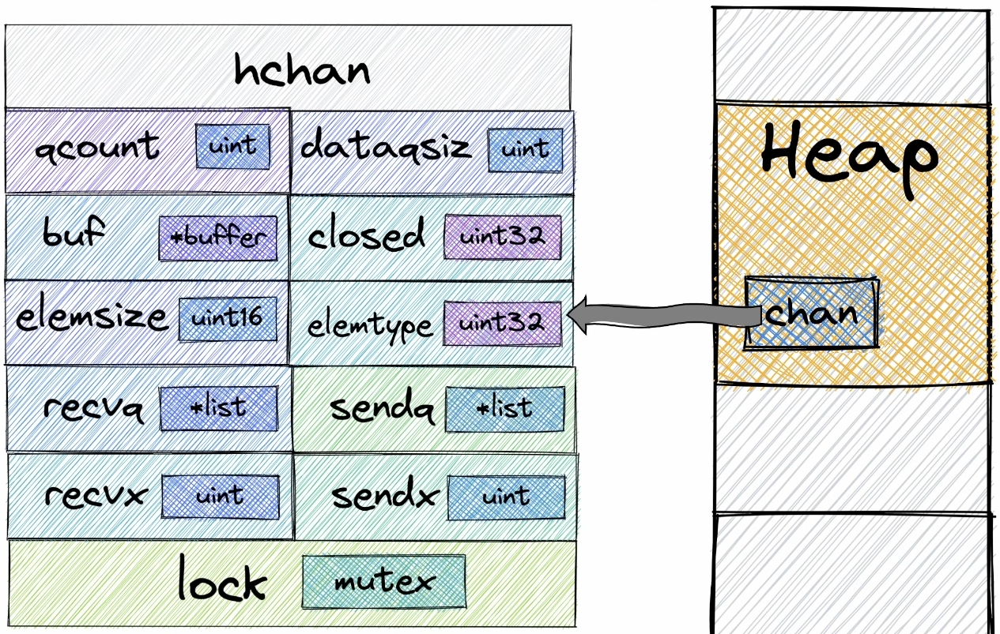

## Channels in Depth
Свойства каналов
* goroutine-safe `hchan mutex`
* хранение элементов, семантика FIFO `hchan buf`
* Передача данных между горутинами `sendDirect()`, operations with buffer
* Блокировка горутин `sendq`, `recvq`, `sudog`, calls to scheduler: `gopark()`, `goready()`

Каналы размещаются в Heap

## Структура Канала:


```
type hchan struct {
	qcount   uint           // total data in the queue
	dataqsiz uint           // size of the circular queue
	buf      unsafe.Pointer // points to an array of dataqsiz elements
	elemsize uint16
	closed   uint32
	timer    *timer // timer feeding this chan
	elemtype *_type // element type
	sendx    uint   // send index индексы ячеек буфера, в которые будет производится запись
	recvx    uint   // receive index индексы ячеек буфера, из которых будет производится чтение
	recvq    waitq  // list of recv waiters
	sendq    waitq  // list of send waiters
	bubble   *synctestBubble

	// lock protects all fields in hchan, as well as several
	// fields in sudogs blocked on this channel.
	//
	// Do not change another G's status while holding this lock
	// (in particular, do not ready a G), as this can deadlock
	// with stack shrinking.
	lock mutex
}

type waitq struct {
	first *sudog
	last  *sudog
}
```

## Отправка в канал
1) Происходит блокировка мьютекса
2) Данные из горутины - sender'а будут *скопированы* в канал и добавлены в очередь
3) Происходит разблокировка мьютекса(Теперь с каналом может работать любая другая горутина)

## Чтение из канала
1) Происходит блокировка мьютекса
2) Данные будут скопированы из очереди в горутину-ресивер
3) Разблокировка мьютекса

## Переполнение буфера
* Если sender хочет записать больше данных, чем размерность буффера, то при попытке переполнить буфер, горутина sender будет поставлена на паузу

## Планировщик в контексте каналов
* Горутины не выполняются параллельно. Паралелльно выполняются системные треды, которые занимаются переключением горутин
* Все горутины, висящие на системном треде будут выстраиваться в очереди, соответствующие каждому системному треду и выполнятся последовательно, в то время, как контекст будет переключаться между ними и работать так, чтобы ни один из потоков не простаивал.


## Как горутина ставится на паузу
1) sender кладет данные в канал
2) `ch <- data` вызывает `gopark()`
3) `gopark()` обращается напрямую к планировщику
4) планировщик меняет состояние sender'а из `running` в `waiting`
5) планировщик разрывает связь горутины с ее системным тредом
6) если в `runq` есть какая-то горутина, планировщик вешает ее на освободившийся системный тред

## Как горутина пробуждается
1) Горутина попадает в очередь `sendq` - очередь горутин, ожидающих записи
2) `sendq`- это ссылка на структуру waitq, хранящая ссылки на начало и конец связанного списка
3) Элементы связанного списка представляют из себя структуру `sudog`, хранящую параметр `G` - спящую горутину и `elem` - елемент, который горутины пытается отправить
4) Если бы спящей горутиной был ресивер, в elem хранилась бы ссылка на ячейку, куда данные нужно положить
5) структура `sudog` добавляется в очередь `sendq`
6) Когда ресивер прочитает данные из канала, они будут прочитаны из самой первой ячейки очереди, далее указатель `recvx` сдвинется на 1 вправо
7) Теперь в буффере появилась свободная ячейка, поэтому спящая горутина sender просыпается
8) Оптимизация: Пробуждением спящего сендера будет заниматься ресивер: он посмотрит если в очереди `sendq` есть спящая горутина то он возьмет ее элемент и положит в буффер
9) Ресивер обращается к `goready()`, она меняет состояние спящего сендера на `runnuble`, сендер попадает в очередь `runq`

## Чтение из пустого канала
1) Если ресивер пытается прочитать из пустого канала, вызывается `gopark()` и ресивер попадает в `recvq`
2) формируется структура `sudog`, в которой elem - ссылка на ячейку, куда нужно будет положить данные после чтения
3) Приходит sender 
4) Оптимизация: с помощью `sendDirect` данные перемещаются из стека одной горутины в стек другой, минуя буффер, чтобы не делать лишних копирований

## Небуферизированные каналы
1) Нет буфера, поэтому данные будут передаваться из стека одной горутины в стек другой

## Select
1) Кейсы внутри селекта сортируются в случайном порядке
2) В конструкции select чтение из каналов неблокирующее
3) Дефолтный кейс срабатывает если предыдущие кейсы(например чтение из и запись в канал невозможны)

## Закрытие канала
1) Канал инициализирован? Паника если нет.
2) Блокируем мьютекс
3) Канал закрыт? Паника если да.
4) set ch.closed = true
5) Отпускаем все ресиверы
6) Отпускаем всех сендеров - они запаникуют
7) Разблокируем мьютекс
8) Разблокируем все горутины
